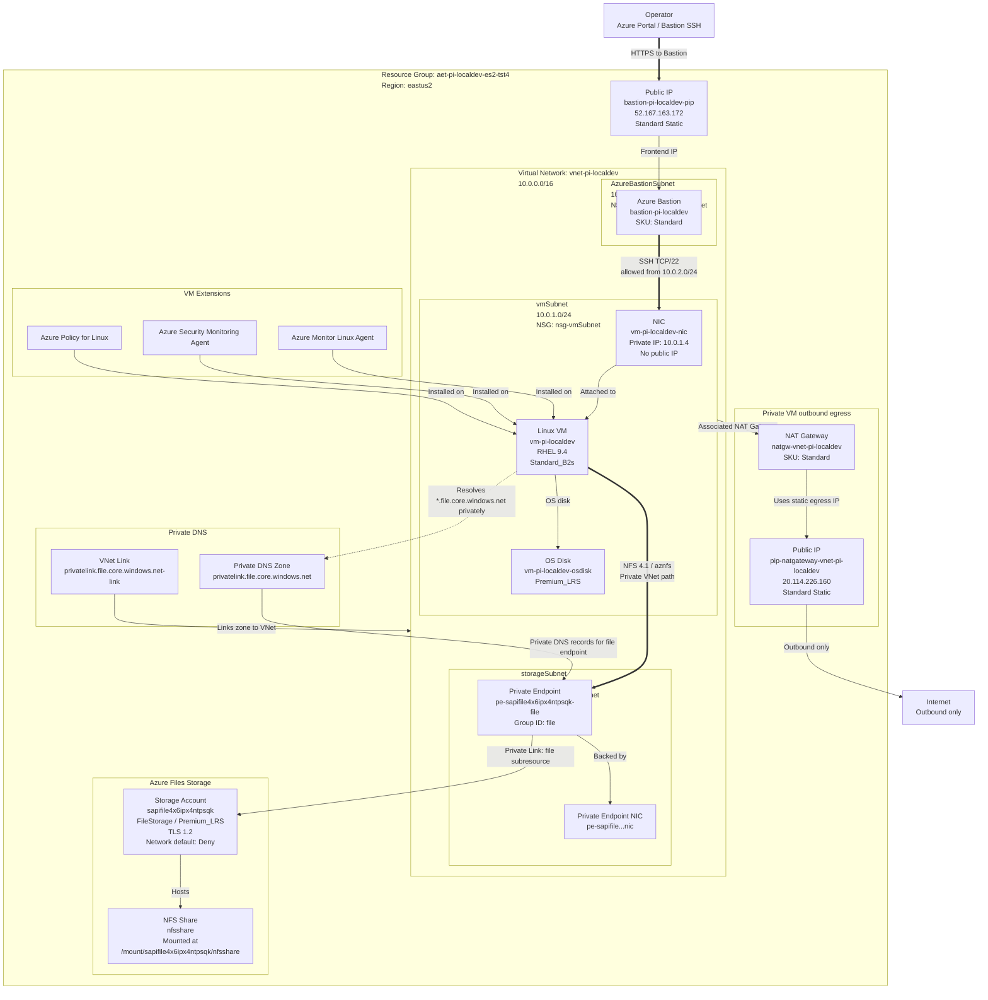

# Azure Architecture: aet-pi-localdev-es2-tst4

**Subscription:** AEPSovereign_EncryptedTransport_Sandbox (`3b51b584-f9aa-43ce-b60e-9f1c6d8332e4`)  
**Region:** eastus2  
**Resource group:** `aet-pi-localdev-es2-tst4`

## Summary

This resource group hosts a private Azure network for a Red Hat Enterprise Linux VM with Azure Files NFS access. The VM has no public IP address and is reachable through Azure Bastion only.

Outbound internet access for the private VM subnet is provided by a NAT Gateway with a static Standard public IP. Azure Files is exposed into the VNet through a private endpoint in the storage subnet, with private DNS resolution through `privatelink.file.core.windows.net`.

## Resource Inventory

| Resource | Type | Key details |
|---|---|---|
| `vnet-pi-localdev` | Virtual network | `10.0.0.0/16` |
| `vmSubnet` | Subnet | `10.0.1.0/24`, associated with NAT Gateway and `nsg-vmSubnet` |
| `AzureBastionSubnet` | Subnet | `10.0.2.0/24`, associated with `nsg-AzureBastionSubnet` |
| `storageSubnet` | Subnet | `10.0.3.0/24`, associated with `nsg-storageSubnet` |
| `vm-pi-localdev` | Virtual machine | RHEL 9.4, `Standard_B2s`, private IP `10.0.1.4`, admin `azureuser` |
| `vm-pi-localdev-nic` | Network interface | Attached to `vmSubnet`, no public IP |
| `vm-pi-localdev-osdisk` | Managed disk | `Premium_LRS` |
| `bastion-pi-localdev` | Azure Bastion | `Standard` SKU |
| `bastion-pi-localdev-pip` | Public IP | `52.167.163.172`, Standard, Static |
| `natgw-vnet-pi-localdev` | NAT Gateway | Standard SKU |
| `pip-natgateway-vnet-pi-localdev` | Public IP | `20.114.226.160`, Standard, Static |
| `sapifile4x6ipx4ntpsqk` | Storage account | `FileStorage`, `Premium_LRS`, TLS 1.2, network default action `Deny` |
| `nfsshare` | Azure Files share | NFS share mounted by VM cloud-init |
| `pe-sapifile4x6ipx4ntpsqk-file` | Private endpoint | Connects storage account `file` subresource to `storageSubnet` |
| `pe-sapifile4x6ipx4ntpsqk-file.nic.383251d1-486b-4d7c-bbce-d0b45f70d74a` | Private endpoint NIC | NIC backing the file private endpoint |
| `privatelink.file.core.windows.net` | Private DNS zone | Linked to the VNet |
| `privatelink.file.core.windows.net-link` | Private DNS VNet link | Links private DNS zone to `vnet-pi-localdev` |
| `nsg-vmSubnet` | Network security group | Allows SSH from Bastion subnet; denies internet inbound via managed rules |
| `nsg-AzureBastionSubnet` | Network security group | Bastion inbound/outbound control rules |
| `nsg-storageSubnet` | Network security group | Storage/private endpoint traffic control |
| `Microsoft.Azure.Monitor.AzureMonitorLinuxAgent` | VM extension | Azure Monitor agent |
| `Microsoft.Azure.Security.Monitoring.AzureSecurityLinuxAgent` | VM extension | Security monitoring agent |
| `AzurePolicyforLinux` | VM extension | Azure Policy guest configuration |

## Architecture Diagram

## Relationship Details

- **Administrative access:** Operators connect to Azure Bastion over HTTPS, then Bastion reaches the VM over SSH on TCP/22 through the private VNet.
- **VM isolation:** `vm-pi-localdev` has only a private IP (`10.0.1.4`) and no public IP address.
- **Outbound access:** `vmSubnet` is associated with `natgw-vnet-pi-localdev`, which uses `pip-natgateway-vnet-pi-localdev` for outbound egress.
- **NFS storage path:** The VM mounts `nfsshare` from `sapifile4x6ipx4ntpsqk` through the private endpoint in `storageSubnet`.
- **DNS path:** `privatelink.file.core.windows.net` is linked to the VNet so the storage file endpoint resolves privately.
- **Security boundaries:** Each subnet has its own NSG. The VM subnet specifically allows SSH from `10.0.2.0/24`, the Bastion subnet.

## Notes

- The storage account reports `publicNetworkAccess: Enabled`, but its network rule default action is `Deny`; access is intended through the private endpoint.
- Bastion is deployed as `Standard`; keep deployment parameters aligned to avoid SKU downgrade failures.
- The validation script could identify the storage account and private endpoint, but listing shares from the local client was blocked by storage authorization/network rules.
